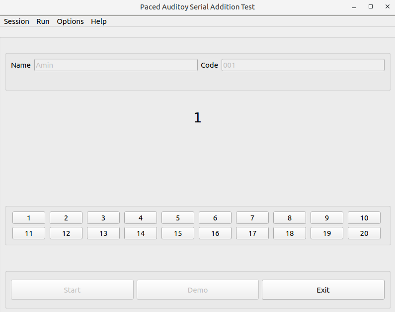

# PASAT
Paced Auditory Serial Addition Test (PASAT) is a neuropsychological test used to assess capacity and rate of information processing and sustained and divided attention. In this test the subjects are given a number every 3 seconds and are asked to add the number they just heard/seen with the number they heard before [wikipedia].
This app is the audiovisual implementation of Paced Auditory Serial Addition Test in English and Farsi developed using PyQt5 (on **Python 3.7**). The range of numbers given to the subject is from 1 to 10, the interval between numbers is 3 seconds (but can be modified under Options -> Preferences). The length of the test is also modifiable in the Preferences.

## Features
 - Mouse and keyboard input
 - English and Farsi language support
 - Measures reaction time and % of correct answers
 - Measures performance in the first and last third of the test duration, as a proxy to cognitive fatigue
 - Save the results as a CSV file
## Usage
~~~bash
git clone https://github.com/amnsbr/PASAT.git 
cd PASAT
pip install -r requirements.txt
python main.py
~~~
